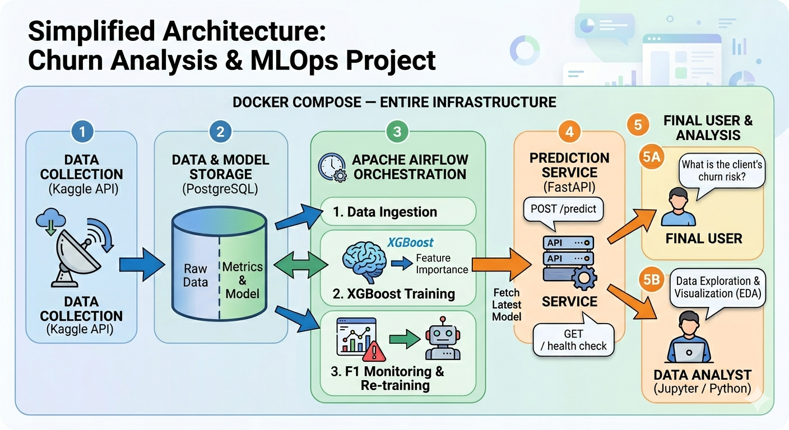

# Churn Analysis & Prediction - MLOps Pipeline

An end-to-end ML pipeline for predicting customer churn using **XGBoost**, orchestrated with **Apache Airflow**, containerized with **Docker Compose**, backed by **PostgreSQL**, and served via a **FastAPI REST endpoint**.

---



### Key Insights from Top 5 Features

| Feature | Insight |
|---------|---------|
| **tenure** | New customers (low tenure) are significantly more likely to churn |
| **Contract_Two year** | Long-term contracts strongly reduce churn probability |
| **InternetService_Fiber optic** | Fiber customers churn slightly more, likely due to higher costs |
| **MonthlyCharges** | Higher monthly charges correlate with increased churn risk |
| **TotalCharges** | Reflects cumulative relationship value — lower total = higher churn risk |
---

## Architecture

```
Docker Compose
├── PostgreSQL              ← raw data storage + model metrics
├── Apache Airflow          ← pipeline orchestration
│   ├── DAG 1 — Ingest
│   │   ├── t1: Download dataset from Kaggle API
│   │   └── t2: Load raw data into PostgreSQL
│   ├── DAG 2 — Train & Analyze
│   │   └── t1: Feature Engineering → XGBoost Training → Metrics + Feature Importance → Save to DB
│   └── DAG 3 — Monitor & Retrain        ← MLOps
│       ├── t1: Check F1 score from model_metrics
│       ├── t2: Retrain if F1 < threshold (branch)
│       └── t3: Notify result
├── FastAPI                 ← REST API for real-time churn predictions
│   ├── POST /predict       ← returns churn probability + risk level
│   └── GET  /              ← health check
└── Jupyter / Python        ← EDA, model comparison, metrics visualization
```

---

## Getting Started

### Prerequisites

- [Docker](https://www.docker.com/) & Docker Compose
- Kaggle API credentials (`~/.kaggle/kaggle.json`)

### Run

```bash
git clone https://github.com/your-username/Churn-Analysis-Prediction.git
cd Churn-Analysis-Prediction

# Set environment variables
cp .env.example .env

chmod -R 777 ./models ./scripts ./dags

# Start all services
docker compose up -d --build

# Access Airflow UI
open http://localhost:8000

# Access FastAPI Swagger UI
open http://localhost:8001/docs
```

### Trigger Pipelines

1. In the Airflow UI, trigger **`dag_01_ingest_churn`** — downloads and loads data into PostgreSQL
2. Trigger **`dag_02_train_and_report`** — trains the model and saves metrics
3. The FastAPI service automatically picks up the new model from the shared `/models` volume
4. **`dag_03_retrain_monitor`** runs automatically `@weekly` — checks F1 and retrains if needed

IMPORTANT:

-   You will not be able to run correctly the code blocks in **metrics_eval.ipynb** if you don't follow the steps (triggering the DAGs in the correct order)

---

## ML Pipeline (`pipeline.py`)

| Step | Description |
|------|-------------|
| **Data Fetch** | Reads `raw_churn` table from PostgreSQL via SQLAlchemy |
| **Feature Engineering** | Creates `tenure_group` (new / medium / old) using `pd.cut` |
| **Encoding** | One-hot encodes all categorical features with `get_dummies` |
| **Scaling** | Normalizes numeric columns (`tenure`, `MonthlyCharges`, `TotalCharges`) with MinMaxScaler |
| **Training** | XGBoost classifier (1000 estimators, lr=0.01, max_depth=6) |
| **Evaluation** | Accuracy, F1, Precision, Recall saved to `model_metrics` table |
| **Feature Importance** | Top 5 features by gain saved as JSON in `model_metrics` |
| **Artifacts** | Saves `model_churn.joblib` and `scaler.joblib` to `/models` |
---

## FastAPI — Prediction Endpoint
 
The trained model is served via a FastAPI container accessible at `http://localhost:8001`.
 
### `POST /predict`
 
Accepts a customer profile and returns churn prediction, probability, and risk level.
 
**Example request:**
```bash
curl -X POST "http://localhost:8001/predict" \
  -H "Content-Type: application/json" \
  -d '{
    "tenure": 2,
    "MonthlyCharges": 95.0,
    "TotalCharges": 190.0,
    "InternetService_Fiber optic": 1,
    "Contract_One year": 0,
    "Contract_Two year": 0,
    ...
  }'
```
 
**Example response:**
```json
{
  "churn": true,
  "churn_probability": 0.8923,
  "risk_level": "High"
}
```
 
| `risk_level` | Probability range |
|---|---|
| `High` | > 0.70 |
| `Medium` | 0.40 – 0.70 |
| `Low` | < 0.40 |
 
The full interactive API documentation (Swagger UI) is available at **`http://localhost:8001/docs`**.
 
### Testing the endpoint
 
A bash test script is included to validate model behavior against expected risk profiles derived from EDA insights:
 
```bash
chmod +x fastapi/test_api.sh
./fastapi/test_api.sh
```

Result from bash test script:

```
========================================
  Churn Prediction API — Test Suite
  http://localhost:8001
========================================

--- Health Check ---
Response: {"status":"Churn Prediction API is running"}

--- Predict Tests ---

[1] New customer, month-to-month, fiber optic
PASS — New + month-to-month + fiber → High risk
churn=true | probability=0.8607 | risk=High

[2] Old customer, two-year contract, no internet
PASS — Old + two-year + no internet → Low risk
churn=false | probability=0.0001 | risk=Low

[3] Medium tenure, one-year contract, DSL
FAIL — Medium tenure + one-year → Medium risk
Expected risk=Medium | Got risk=Low
churn=false | probability=0.0612

========================================
  Results: 2 passed | 1 failed
========================================
```

---

## MLOps — Automated Monitoring & Retraining (DAG 3)
 
`dag_03_retrain_monitor` implements a basic MLOps loop that runs **every week** and checks whether the model is still performing above the acceptable threshold.
 
```
check_performance
      │
      ├── F1 < 0.75 ──→ retrain ──→ notify_result
      │
      └── F1 >= 0.75 ─→ skip_retrain ──→ notify_result
```
 
**Why this matters in production:** When DAG 1 ingests new customer data over time, the model is automatically retrained on the expanded dataset if performance degrades — without any manual intervention. This closes the loop between data ingestion and model freshness.
 
| Component | Role |
|---|---|
| `BranchPythonOperator` | Reads latest F1 from `model_metrics` and decides branch |
| F1 threshold (`0.75`) | Configurable minimum acceptable performance |
| `@weekly` schedule | Runs automatically every week |
| XCom | Passes F1 value between tasks for the notify step |
 
---

## Exploratory Data Analysis

The EDA notebook (`scripts/EDA.ipynb`) covers:

- Class distribution (churn vs. no churn)
- Correlation analysis and feature distributions
- Comparison of 3 ML models before selecting XGBoost
- SHAP-based feature importance interpretation

## Database Schema

### `raw_churn`
Raw customer data ingested from Kaggle (Telco Customer Churn dataset).

### `model_metrics`
Populated after each DAG 2 run:

| Column | Type | Description |
|--------|------|-------------|
| `run_date` | timestamp | When the pipeline ran |
| `accuracy` | float | Test set accuracy |
| `f1_score` | float | F1 score |
| `precision` | float | Precision |
| `recall` | float | Recall |
| `model_path` | text | Path to saved `.joblib` model |
| `top_features` | json | Top 5 features with importance scores |

---

## Project Structure

```
.
├── README.md
├── airflow
│   └── dags
│       ├── __pycache__
│       │   ├── dag_ingest.cpython-312.pyc
│       │   ├── dag_retrain.cpython-312.pyc
│       │   └── dag_train.cpython-312.pyc
│       ├── dag_ingest.py
│       ├── dag_retrain.py
│       └── dag_train.py
├── data
│   └── WA_Fn-UseC_-Telco-Customer-Churn.csv
├── docker-compose.yaml
├── fastapi
│   ├── Dockerfile
│   ├── __pycache__
│   │   └── app.cpython-312.pyc
│   ├── app.py
│   ├── requirements.txt
│   └── test_api.sh
├── models
│   ├── logistic_model.pkl
│   ├── model_churn.joblib
│   ├── random_forest_model.pkl
│   ├── scaler.joblib
│   └── xgb_model.pkl
├── postgres
│   └── data  [error opening dir]
├── postgres_conn.sh
├── scripts
│   ├── EDA.ipynb
│   ├── __pycache__
│   │   └── pipeline.cpython-312.pyc
│   ├── metrics_eval.ipynb
│   ├── pipeline.py
│   └── requirements.txt
├── secrets
│   └── kaggle.json
└── test_db.sh
```

---

## Tech Stack


---
